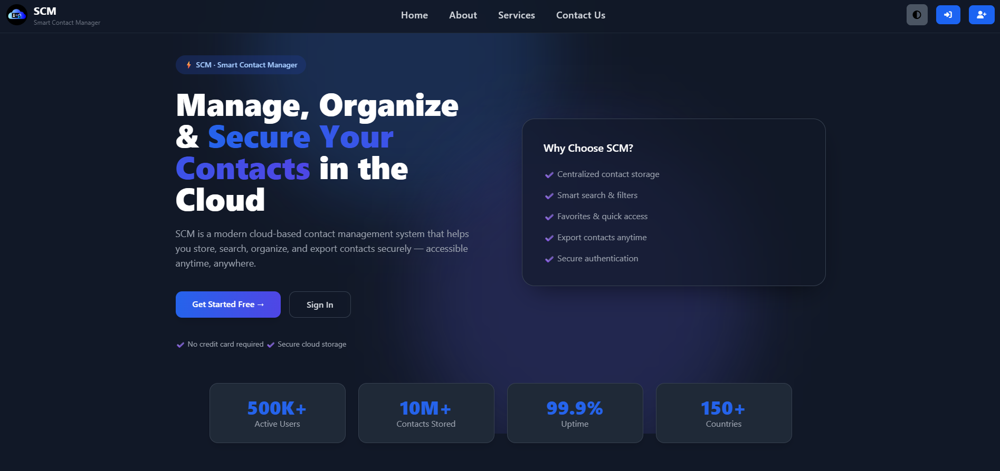

## Home Page

# Smart Contact Manager (SCM) 🚀

A full-stack Smart Contact Manager application built using Java, Spring Boot, Spring Security, Hibernate, MySQL, Thymeleaf, OAuth2, Cloudinary, and Tailwind CSS.

## Features

* User Authentication & Authorization
* Google, GitHub & Facebook OAuth Login
* Contact Management (CRUD)
* Profile Management
* Image Upload with Cloudinary
* Email Services
* Responsive UI using Tailwind CSS
* Secure Spring Security Configuration

## Important Notes 📌

Hey 👋

If you are planning to run, deploy, or contribute to this project, please make sure to check the following files before getting started:

* 📖 **Read Me - How To Deploy SCM In AWS**
* 🐞 **Read Me - Some Bugs and Issues SCM**
* 🔑 **Read Me - Default User For Sign In**
* 🎨 **Read Me - TailwindCSS Command To Activate**

These files contain important setup instructions, deployment guidance, known issues, and useful commands that can save you a lot of time.

## Tech Stack

* Java 21
* Spring Boot
* Spring Security
* Hibernate / JPA
* MySQL
* Thymeleaf
* OAuth2
* Cloudinary
* Tailwind CSS
* AWS Elastic Beanstalk

## Author

**Chirag Rawat**
